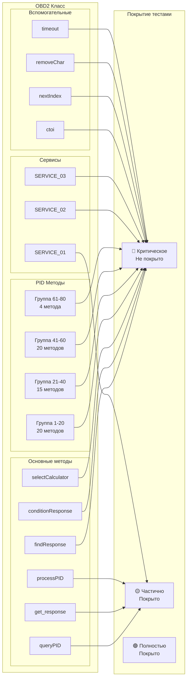
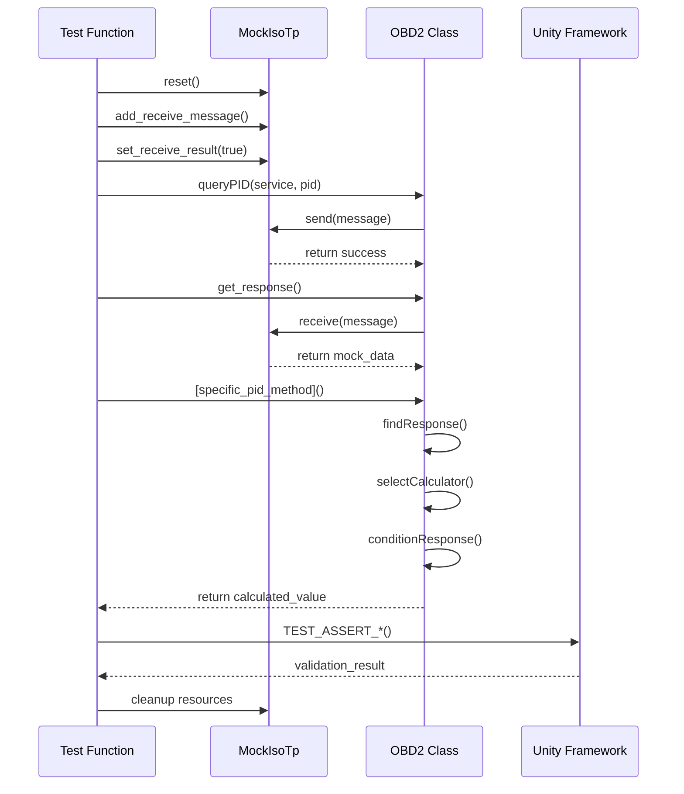

# Диаграмма архитектуры тестирования OBD2

## Общая архитектура тестовой системы

```mermaid
graph TB
    subgraph "Тестовая архитектура OBD2"
        subgraph "Критический приоритет"
            A[tests_obd_core_methods.cpp<br/>25-30 тестов]
            B[tests_obd_services.cpp<br/>15-20 тестов]
        end
        
        subgraph "Высокий приоритет"
            C[tests_obd_pid_group_1_20.cpp<br/>35-40 тестов]
            D[tests_obd_pid_group_21_40.cpp<br/>25-30 тестов]
            E[tests_obd_pid_group_41_60.cpp<br/>30-35 тестов]
            F[tests_obd_pid_group_61_80.cpp<br/>10-15 тестов]
            G[tests_obd_error_handling.cpp<br/>20-25 тестов]
        end
        
        subgraph "Средний приоритет"
            H[tests_obd_performance.cpp<br/>15-20 тестов]
        end
        
        subgraph "Существующие тесты"
            I[tests_obd_basic.cpp<br/>9 тестов]
            J[tests_obd_integration.cpp<br/>9 тестов]
            K[tests_obd_pids.cpp<br/>17 тестов]
        end
    end
    
    subgraph "Инфраструктура тестирования"
        L[MockIsoTp<br/>Мок ISO-TP интерфейса]
        M[Unity Framework<br/>Тестовый фреймворк]
        N[OBD2 Helper Functions<br/>Вспомогательные функции]
    end
    
    A --> L
    B --> L
    C --> L
    D --> L
    E --> L
    F --> L
    G --> L
    H --> L
    I --> L
    J --> L
    K --> L
    
    A --> M
    B --> M
    C --> M
    D --> M
    E --> M
    F --> M
    G --> M
    H --> M
    I --> M
    J --> M
    K --> M
    
    A --> N
    B --> N
    C --> N
    D --> N
    E --> N
    F --> N
    G --> N
    H --> N
```



## Структура покрытия по компонентам



## Поток выполнения тестов



## Матрица зависимостей тестов

```mermaid
graph TD
    subgraph "Базовые тесты"
        A[Constructor Tests]
        B[Mock Infrastructure Tests]
    end
    
    subgraph "Основные методы"
        C[queryPID Tests]
        D[get_response Tests]
        E[findResponse Tests]
        F[conditionResponse Tests]
        G[selectCalculator Tests]
    end
    
    subgraph "PID тесты"
        H[PID Group 1-20]
        I[PID Group 21-40]
        J[PID Group 41-60]
        K[PID Group 61-80]
    end
    
    subgraph "Интеграционные"
        L[Service Tests]
        M[Error Handling]
        N[Performance Tests]
    end
    
    A --> C
    B --> C
    C --> D
    D --> E
    E --> F
    F --> G
    
    G --> H
    G --> I
    G --> J
    G --> K
    
    H --> L
    I --> L
    J --> L
    K --> L
    
    L --> M
    M --> N